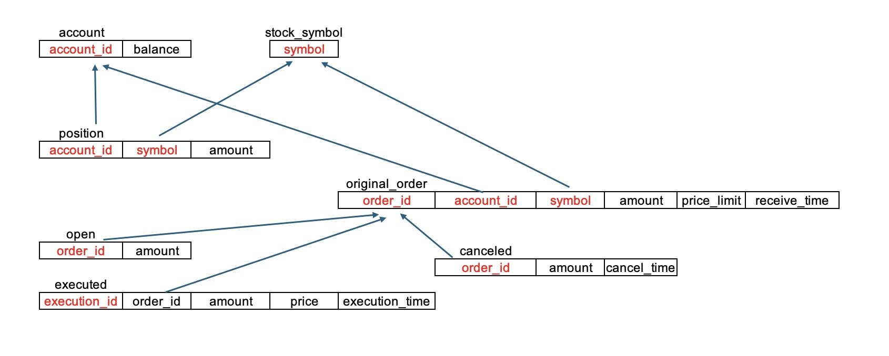

---

# Project Design

## Database Design

## Multi-thread Design

### Strategy Overview
The server application is designed to spawn a new thread for each incoming client request. This approach enables simultaneous and independent processing of multiple requests.

### Implementation
Utilizing the std::thread class from the C++ standard library, our server creates a thread that executes a designated function, "*handleClient*", which manages the request-specific operations.

# Scalability

## Test Infrastructure

The primary aim is to assess scalability by limiting the server and the client's operation to different numbers of CPU cores and observing the impact on handling a set number of requests.

### CPU Core Limitation
The server and client's CPU core usage is restricted in varying scenarios to 1, 2, 4, and 8 cores. This is achieved using the taskset command, which effectively constrains the server to operate within the defined core limit.

From server's side, we modify the command line to limit server run on specific core:

From client's side, we modify the run_test.bh to limit server run on specific core:

### Test Case Execution
A total of 30 distinct test cases are executed, each run 50 times, culminating in 1500 requests. This approach ensures a comprehensive analysis over multiple iterations, providing a robust dataset for evaluating performance across different CPU core allocations.

In addition to limiting the server to run on different numbers of CPU cores, the testing strategy includes simulating varying levels of client-side concurrency. This is achieved by altering the number of client instances simultaneously sending requests to the server.

### Adjusting Client Load:
The number of concurrent client instances, referred to as ”instances”, is systematically varied during tests. This approach allows the evaluation of server performance under different levels of client request loads.

### Simultaneous Request Dispatch: 
The method involves initiating multiple clients concurrently, each sending requests to the server at the same time. This setup mimics real-world scenarios where a server may face simultaneous incoming traffic from numerous sources

